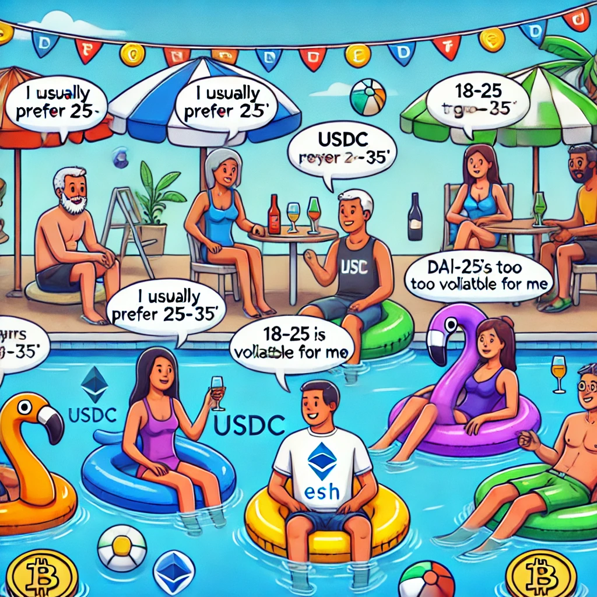

When using DEXs like Uniswap (and the rest of DeFi... AND TradFi too) there's a bunch of jargon that's difficult to understand for newbies.
I believe strongly that understanding these concepts is crucial for anyone who doesn't want to get burnt.

Turns out, Dating Apps are a great place to learn about DeFi, even if they're [not great for finding "the one" these days](https://www.theguardian.com/lifeandstyle/2024/dec/08/it-feels-like-admin-why-are-people-falling-out-of-love-with-dating-apps).

In this post, we'll explore Makers, Takers, Liquidity, Liquidity Pools, Liquidity Concentration, and Ticks through the lens of a dating App.

By the end, my goal is that you'll be able to read a whole page of the Uniswap docs without feeling like you're reading a foreign language.
That's right - a whole f**king page.

*Image above is from ChatGPT prompt of: "create a swimming pool, with people labelled as assets chatting as if they're on a date"*

Let's start with Bumble.
It's perfect for understanding DeFi because its entire model is built on Makers and Takers.
Women make the first move (the "Takers").
Men set their parameters and wait for matches (the "Makers").

In London, you're visible to thousands of potential matches within a 5-mile radius.
You can afford to be specific: age 35-36, must love chess, has to be into crypto.
You've just added liquidity to a highly liquid market.
Even my ugly schmuck might get a few matches.

*Side note - while checking the spelling of "schmuck", I discovered there's actually a [dating site called Ugly Schmuks](https://www.uglyschmucks.com/).
Doesn't look like there's much liquidity in what's surely a very niche market!*

Anyway, back to Bumble... One day, you visit your friend in the Lake District (for non-UK readers, think backend of nowhere), open Bumble up and... nothing.
Your liquidity is too concentrated. You'll need to widen your age range to 20-40.

But wait... you're on holiday!
You don't want to slave away on Bumble all the time.
Why not just add yourself on a much lower and more specific (mid-life crisis) level of 25-26.
You've just done a Bumble "Limit Order".

Before this dating analogy gets any more awkward, let's break down each DeFi concept that has a Dating equivalent..

### Takers
In Bumble, women are the Takers - they initiate matches by making the first move.
In DeFi, a Taker is typically just a user who wants to make a trade. Like when you swap ETH for USDC on Uniswap. You're taking liquidity that's already there.

### Makers
Men on Bumble are the Makers - they set their parameters (age range, distance) and wait for someone to match with them.
In DeFi, Makers provide liquidity to pools and wait for Takers to come along.
They set their price ranges and wait for trades to happen.

### Liquidity / Liquidity Pool / LP
The amount of Men on Bumble is your liquidity pool.
London has high liquidity like the DAI/USDC pair - stable, predictable, but highly competitive.
The Lake District has practically none, like a newly launched token pair."

### Liquidity Concentration / Custom Price Range
This is the age range you set.
If you're in London, you can keep it tight.
Like adding liquidity for DAI/USDC at the price range of $0.99-$1.01.

If you're in the Lake District (and getting desperate), you'll likely need to be at 18 - 99 to get anything at all.
This is like adding liquidity for a freshly created coin with an infinite range.

### Tick
In the world of dating apps, a "tick" is 1 year in the age range.
Each step up or down represents a discrete change in your potential matches.

### Range Orders
In London, let's say you're 35 and set your age range to 30-40.
That's like providing liquidity in a stable price range.
But what if you're specifically looking for someone younger?
Without going too weird, you could set your range to 25-26.

This is similar to Limit Orders - you want your trade to happen at a specific price.
There are some technical details (like one-sided liquidity, partial fills and maker fees) that the dating analogy doesn't extend to, so I'll save those for another post.

### Price Impact
In London, your matching doesn't affect other users' chances of finding "the one" much - there's plenty more fish in the pool.
In the Lake District, one person finding a match significantly reduces options for others - there are probably only about three single people!

This is very relevant in DeFi as trades that come before yours can "sandwich" and "snipe" and have a huge impact on the price you get.
I thought about comparing them to how Bumble Premium works, but that's a bit of a stretch.
Another one that needs another post.

Now go and read [this page of the Uniswap docs](https://docs.uniswap.org/concepts/protocol/concentrated-liquidity) and I hope the concepts will feel a lot more familiar.
If it did help, I'm just getting started with helping real crypto users upskill and protect themselves from being burned.

While this concludes our dating app analogies, next will be:
* More essential technical concepts every DeFi user must understand.
* Understanding and defending against MEV, sandwich attacks, sniping, and rug pulls.
* Real-world examples through Dune Analytics and Etherscan data - showing you exactly how and where these attacks happen.

So stick with me on your crypto journey on [X](https://twitter.com/tomtollinton) and [Substack](https://tomtoll.substack.com/).
