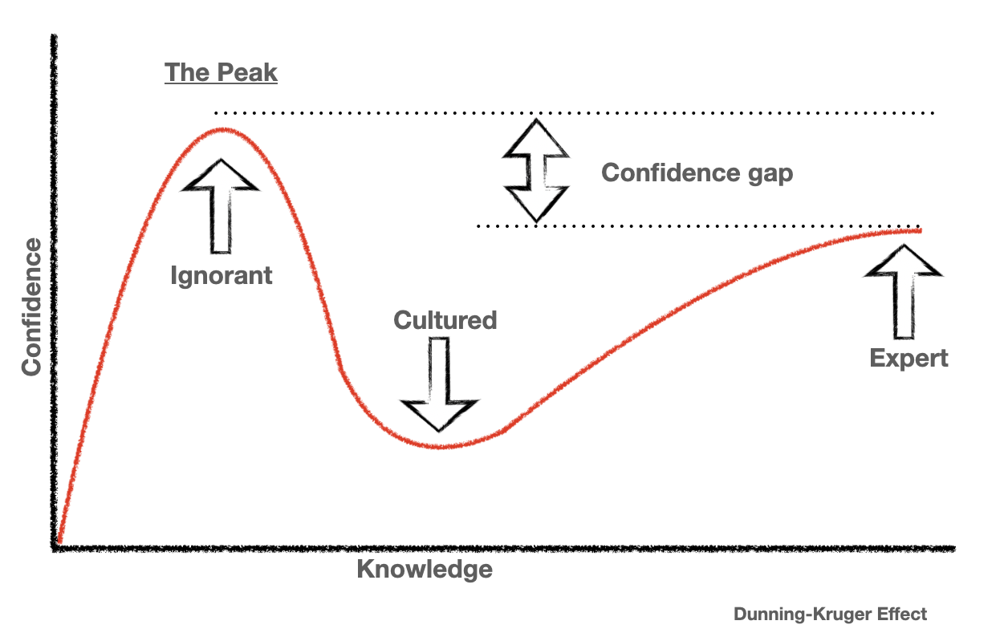

I like referring to the Dunning Kruger effect.
I see it's impact everyday.
I see it in myself, my team, my peers, managers, political leaders, friends, and family.

In this post, I'm going to explore affect in abstract.
What is it?
Can you be aware of it?
Why it matters.
It's at times a paradoxical thought experiment that has a profound impact on the world.

## A definition

The Dunning-Kruger effect is a cognitive bias in which individuals who lack competence in a particular area overestimate their abilities and believe they are more skilled or knowledgeable than they actually are. Conversely, those who are highly skilled or knowledgeable may underestimate their abilities due to their assumption that others are similarly competent. In short, it's a phenomenon where incompetence can lead to an overestimation of one's own abilities, and expertise can lead to an underestimation of one's abilities.

## Why does this matter?
The Dunning-Kruger is a description of the cycle of self-awareness when it comes to expertise.
Self-awareness is one of the most important skills you can have - especially as a leader.

Self-aware people are more humble. They're more likely to seek self improvement. They're more likely to be open to feedback. They're more likely to be open to new ideas. They're more likely to be open to new ways of doing, thinking and being.

I could write a whole post on the importance of self-awareness.
I probably will.
However, this post is about self-awareness of expertise. Namely the Dunning-Kruger effect.

## Can I be aware of it?
I don't know much about wine.
If I were to go to a couple of wine tastings, I'll to be vulnerable to "Peak Ignorance".

Picture the scene: you're at a dinner party and you've just been seated next to me.
What's the topic of discussion?
My newfound expertise in wine.
You watch in horror as I pick up my glass of red and swirl it around, making a big show of it.
"Ah, yes, I'm getting notes of oak, with a hint of blackcurrant."
This is going to be a long night for you.

As the meal progresses, I continue to pontificate about the wine, using phrases like "terroir" and "bouquet" with abandon. You glance around the table, hoping someone will change the subject, but everyone seems to be nodding along, impressed by my supposed knowledge.

You can take it no longer. "Excuse me," you say, interrupting their monologue. "Do you actually know anything about wine, or are you just making it up as you go along?"

I look offended. "Of course I know about wine," I say. "I went to a wine-tasting evening last week."

I'm sure there's **a lot** of things to learn about wine tasting.
I don't know what I don't know.
That's 2 levels of not knowing.

How can I be aware of things that I can't conceive?

The only option is to be self-aware at a more generic level.
When approaching any new topic, you need to be aware that there's likely a lifetime of expertise you can't imagine and all you can do is.

Perhaps you need to Dunning-Kruger the Dunning-Kruger.

## A thought experiment
I've just made Dunning-Kruger a verb. Yay me.
Let's try it out.
How good am I at being aware of my own ignorance?
Or, where am I on the Dunning-Kruger curve when it comes to knowing where I am on the Dunning-Kruger curve?

I like to think I'm pretty self-aware - but maybe that's peak ignorance.
Moreover, It'd be highly embarrassing to overestimate my self-awareness.
That's like shouting that you don't shout much... Or saying I'm an excelent speller.

But if I acknowledge that I'm at Peak Ignorance, that makes me aware of it.
It's a contradictory statement.

Being aware of yourself makes you more likely to avoid Peak Ignorance. 
However, it makes you much more susceptible to imposter syndrome.

## Imposter Syndrome
The Dunning-Kruger effect is a 2-sided coin with peak ignorance on one side and imposter syndrome on the other.

Peak ignorance is the result of overestimating one's own abilities, while imposter syndrome is the result of underestimating them.

Firstly, people with imposter syndrome may be more likely to underestimate their own abilities due to their fear of being exposed as a fraud.
This can lead them to downplay their accomplishments and shy away from taking on new challenges.

Secondly, people with imposter syndrome may actually be quite competent, but they don't recognize it because they are comparing themselves to an unrealistic standard of perfection. This can lead to a cycle of self-doubt and negative self-talk, which can be detrimental to their self-esteem and well-being.

## Complimentary forces
Peak Ignorance and Imposter Syndrome alarmingly complement each other.
Group decisions are more likely to be made by the overly confident "Peak Ignorant" than the overly self-doubting "Imposters".
While it's the "Imposter" are are knowledgable.
