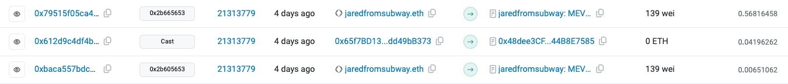

Yeesh… The Obligatory "MEV" post. Apologies in advance. If my Substack was an album, consider this one a filler. If there's anything you should take from this post it is:

1. MEV isn't going anywhere - however much code you throw at it. It's just a fact of life in an efficient market.
2. I just want to write about juicy stuff like Sniping, Sandwiching, Trading bots and the like.

*Screenshot from etherscan.io of the notorious jaredfromsubway sandwiching a user out of $35,000.*

## What is MEV?

The acronym sucks. It just means arbitrage opportunities in Crypto. I.e… Given a set of transactions, can I add my own trades that will guarantee me a profit?

## Typologies

Apparently I now the kind of guy who uses the word "typologies"? FML.

### Arbitrage

In all complex financial markets, arbitrage opportunities arise. When users trade on DEXs (Decentralized Exchanges) and CEXs (Centralized Exchanges), that leads to price differences across platforms. Traders can profit by buying an asset on one platform where the price is lower and immediately selling it on another platform where the price is higher. This is a form of MEV.

While it may seem like traders are profiting at the expense of other users, arbitrage actually helps keep prices in sync across different platforms. Without it, prices could diverge significantly, making it harder for users to get fair value for their trades.

### Liquidations

In DeFi (Decentralized Finance) lending protocols, users can borrow funds by putting up collateral. If the value of their collateral drops below a certain threshold, their position is liquidated - the collateral is sold to repay the loan. Liquidation events can be predicted in advance, creating MEV opportunities for traders who can front-run these liquidations and buy the collateral at a discount.

### Oracles

Many blockchain applications rely on oracles to provide real-world data, such as asset prices. When an oracle updates its data, it can trigger significant events in the application. For example, a price update could cause a large number of liquidations in a lending protocol. Traders who can predict these oracle updates can position themselves to profit from the resulting events.

## Good MEV

While the examples above show how MEV can be used for personal gain, it's important to recognize that MEV also plays a vital role in keeping blockchain networks and applications functioning smoothly.

Arbitrage, as mentioned, helps keep prices synchronized across different trading platforms. This is crucial for maintaining a healthy, efficient market.

Liquidations, while painful for the individual being liquidated, are necessary for DeFi lending protocols to function. They ensure that lenders can recover their funds if borrowers are unable to repay.

Oracle updates, even when they trigger disruptive events, are essential for keeping blockchain applications connected to the real world. Without reliable oracle data, many DeFi applications simply couldn't function.

Moreover, MEV can be a source of revenue for blockchain validators and miners. This incentivizes them to keep contributing their resources to secure and maintain the network.

## Inevitable Goodness!

These forms of MEV, particularly those that involve backrunning or arbitrage between blocks, are virtually impossible to prevent. To understand why, let's consider how these strategies work.

Backrunning is when a trader sees a profitable transaction in a newly mined block and tries to replicate it in the next block. For example, if a large trade on a DEX causes a significant price movement, a backrunner might try to make the same trade in the next block to profit from the price change.

Arbitrage between blocks is similar. If the price of an asset differs between two DEXs, a trader can buy on the lower-priced DEX and sell on the higher-priced one. But by the time their transaction is mined, the price may have changed. So they send the same trade to the next block, hoping to get the original price difference.

The key point is that these strategies don't involve any manipulation of the current block. They're purely forward-looking, trying to profit from information that's already public. As such, there's no practical way to prevent them without fundamentally changing how blocks are constructed and propagated in a blockchain.

You could try to introduce a rule that transactions can't be repeated in consecutive blocks, but that would be extremely difficult to enforce and would likely have unintended consequences. It would also just push the opportunity out to the next block, or the one after that.

## The Bad

The main type of "bad" MEV is frontrunning. This is when an attacker is able to get their transaction in before the user to manipulate price. Unlike the other types of MEV, this actually "steals" money from the user. A Sandwich attack involves both a "frontrun" and a "backrun". A trader can get in front of a large trade to buy an asset, then selling it back to the original trader at a higher price. These strategies rely on being able to manipulate the order of transactions within a block. If we can prevent that manipulation, we can largely prevent these attacks.

## The Preventability of "Bad"

In contrast to good MEV, sandwich attacks and front-running can be mitigated or prevented with the right approaches.

Sandwich attacks, as we've discussed, involve a trader stepping in front of a large trade to buy an asset, then selling it back to the original trader at a higher price. Front-running is similar, but doesn't necessarily involve selling back to the original trader.

These strategies rely on being able to manipulate the order of transactions within a block. If we can prevent that manipulation, we can largely prevent these attacks.

One approach is to use a system like Flashbots' MEV-Boost, which allows traders to submit transactions directly to miners rather than broadcasting them to the public mempool. This makes it much harder for sandwich attackers to spot and front-run profitable trades.

Another solution is to use order-flow auctions (OFAs), where all transactions are executed at the same price regardless of their order. This makes it pointless to try to manipulate the transaction order.

Or, in the layer 2 world, a centralized sequencer can stop sandwich attacks. This is because they keep pending transactions private. No one sees the transactions until they are already confirmed. That's how Base does it - and there's practically no sandwich attacks there. Base has less than 1% of the value stolen from sandwich attacks when compared to Ethereum.

## And the Jared…

Ahh jaredfromsubway… Yes you are by far the biggest sandwich attacker in Ethereum. You spend over 2,000ETH (over $6m as of Jan 25) on gas fees each month. This money is effectively stolen from normal crypto users.

I can look past all that… but why, oh why, did you name yourself after a convicted peodophile?

## Conclusion

MEV is a complex phenomenon with both good and bad sides. While it can be used for predatory trading practices, it also plays a crucial role in maintaining the health and efficiency of blockchain networks and applications.

As the blockchain space continues to evolve, it's important that we develop a nuanced understanding of MEV. Rather than writing it off as purely malicious, we need to find ways to mitigate its negative impacts while preserving its positive functions.

This could involve developing new blockchain architectures that are less vulnerable to front-running, or creating incentive structures that align the interests of MEV traders with those of the broader user base.

Regardless of the specific solutions, one thing is clear: MEV is here to stay. As users and builders in the blockchain space, it's up to us to navigate this complex landscape thoughtfully and responsibly.
