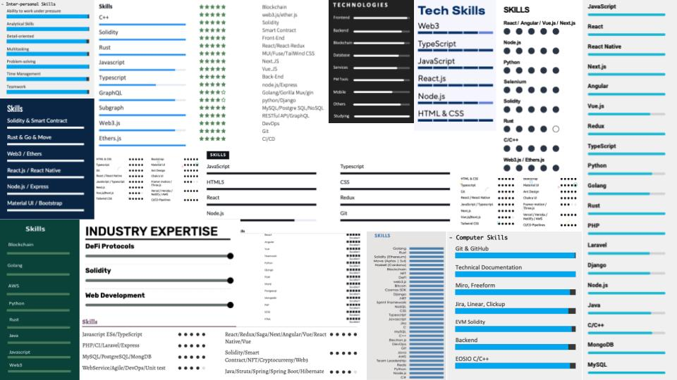

You've probably encountered the self-rating section if you've ever written a CV. You know the one - it's where you judge yourself on a scale of one to five for each skill you possess. But before you go ahead and give yourself all the stars, let's get into your future employers' shoes and talk about the Dunning-Kruger effect.

You see, this effect is real, and it messes with our ability to judge ourselves accurately. It's like the old saying - "you don't know what you don't know." In other words, we overestimate our abilities when we're not good at something. And the more we learn, the more we realise how much we still don't know.

So when you're rating yourself on a CV, you're saying, "Hey, look at me! I'm good at all these things!" But are you? Or are you suffering from a little case of Dunning-Kruger? It's hard to tell.

You might think you're amazing at something, but compared to who? Your mom? Your best friend who knows nothing about the industry? It's all relative. And if you rate yourself too high, you risk looking like a fool in front of potential employers.

So what's the solution? You could rate yourself relative to your skills but ensure the number of stars adds up to a sensible average.

If that makes you uncomfortable, just leave the self-rating section out altogether. After all, it's not like employers will hire you based solely on how many stars you give yourself. Just stick to listing your skills and experience, and let your work speak for itself.

## The “Self-rating” Section

I see a lot of CVs where a candidate has “rated” themselves. Here is a collage from applications within the last month:

In a recent hiring process, I received 163 applications. Twenty-four of them contained ratings. The average of all the skills? 4.63 / 5.

I can only conclude that the candidates believe themselves to be way above average in almost all the skills they possess.

They may be that good. However, put yourself in the shoes of the hirer. Zero average ratings were below four out of five in the 163 CVs I read. Am I supposed to believe that every applicant is a rockstar?

More likely, they are succumbing to the Dunning-Kruger effect.

The Dunning-Kruger Effect
The Dunning-Kruger effect is a cognitive bias in which individuals who lack competence in a particular area overestimate their abilities and believe they are more skilled or knowledgeable than they are. Conversely, highly skilled or knowledgeable people may underestimate their abilities because they assume others are similarly competent. In short, it's a phenomenon where incompetence can lead to overestimating your abilities, and expertise can lead to underestimating one's abilities.

So, am I saying that when it comes to CVs, the lower you rate yourself, the better you will be perceived? Not quite. Rate yourself relative to the other skills you list.

In other words, ensure your ratings have a sensible average (around 3 out of 5). Simply multiply the number of skills you list by three and ensure that the total stars you allocate add up to this number.

For example: Let’s say you’re rating yourself on four skills. You, therefore, have 12 points to allocate. The average will be 3 out of 5.

I realise I’m walking you through elementary school Maths like it’s innovative and novel. I just don’t want this point lost in translation.

Using a rating relative to other skills demonstrates self-awareness of your strengths and weaknesses - one of the most important traits a candidate can possess.

It also helps an interviewer asses you faster. They can evaluate one skill and use that benchmark to extrapolate the rest. For example, suppose a candidate rates themselves as follows:

React: 4*
CSS: 2*

Let’s say an interviewer has assessed this candidate’s CSS skills to be equivalent to what they’d expect of a strong, senior Front End Engineer. The candidate believes they’re even stronger at React… The interviewer could infer that they’re a rockstar at this skill.

If this makes you uncomfortable, that’s fine. But don’t be tempted to rate yourself with an average over four out of five. Just delete the whole section from your CV. Its not helping you.6
