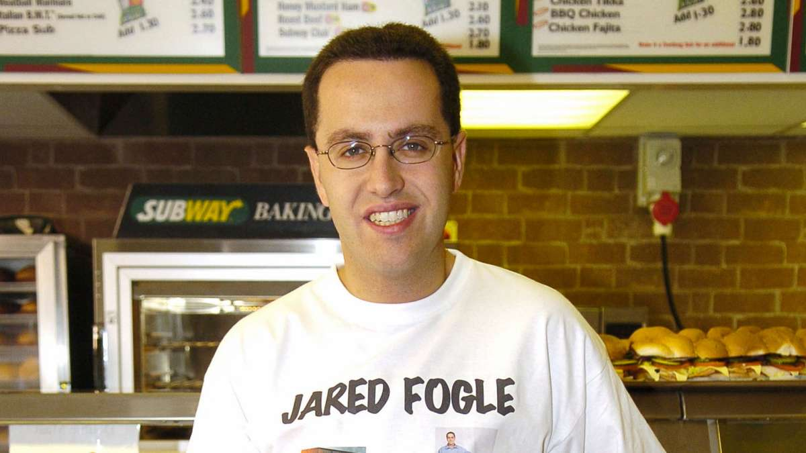
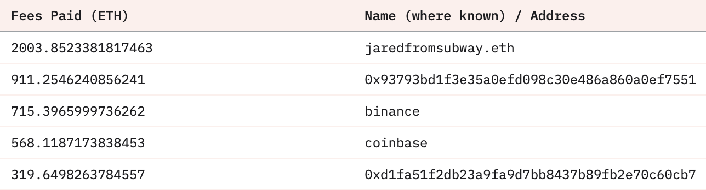
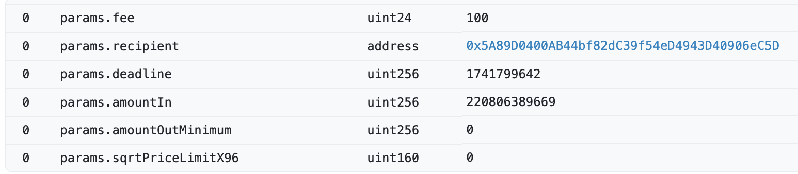
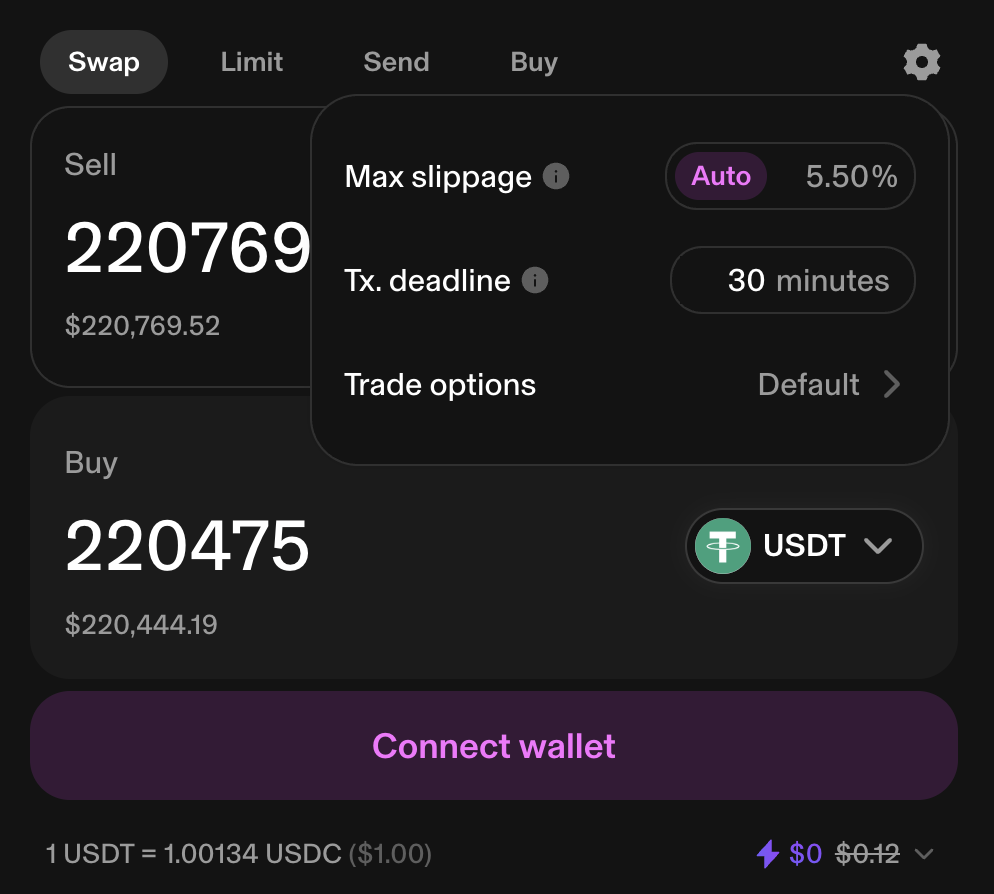

The biggest contributor to your precious ETH staking yield is a thief who names himself after a paedophile… and it's all because of Slippage.

*I think it's pretty shady behaviour to name yourself after a convicted paedophile…*

2 of the top 5 contributors to Ethereum fees are sandwich attackers (as of Jan 2025). Jaredfromsubway.eth leads the way contributing more to your staking rewards than Coinbase and Binance combined.

*The address beginning 0xd1fa is also a sandwich attacker*

How does Jared extract so much ETH? With the help of a fictitious trader called Degen who wants to buy meatballs (MBL) I'll show you. Why meatballs? Because they're somewhat fungible, they're a classic Subway Sandwich and I'm running out of [dating analogies](/posts/dating-apps-and-defi).

Oh and there might be some pun opportunities…

## Price Impact

Meat our token, Meatballs. Its ticker is MBL. Degen wants to buy 10 MBL at the exchange SubSwap.

There are four sellers of MBL:

- Diane: 4 MBL at $0.80 each
- Casey: 4 MBL at $0.90 each
- Bob: 4 MBL at $1.00 each
- Alice: 4 MBL at $1.10 each

In this market, Degen must:
- Buy 4 MBL from Diane for $3.20 ($0.80 each)
- Buy 4 MBL from Casey for $3.60 ($0.90 each)
- Buy 2 MBL from Bob for $2 ($1.00 each)

The average price? $0.88 per MBL. Total damage: $8.80.

The price slid from $0.80 up to $1.00 as Degen ate through the available MBL. This is **price impact**.

> Price Impact: the amount your trade changes the price by "eating" through liquidity at each price point to fill an order.

On DEXs, this happens automatically. When you make a large trade relative to the available liquidity, you'll end up consuming multiple price levels or "ticks"… Pushing your average price higher/lower than what you initially saw.

## 2 Sided Marketplace

So far, Alice, Bob, Casey and Diane have just been **selling** MBL. Now let's imagine SubSwap is an exchange that both buys and sells those juicy MBL.

- Diane has $3.20 and buys/sells at $0.80 each
- Casey has 4 MBL and buys/sells at $0.90 each
- Bob has 4 MBL and buys/sells at $1.00 each
- Alice has 4 MBL and buys/sells at $1.10 each

Notice that Diane has dollars… but Casey, Bob and Alice have **MBL**. This is how you calculate the price of the market:

> The price of a pair (MBL-USD) is between the **lowest** you can buy and the **highest** you can sell.

In this case, the lowest we can buy from is Casey at $0.90. The highest we can sell is Diane for $0.80.

Degen wants to buy MBL at the lowest price possible. The person selling MBL for the cheapest is now Casey at $0.90. When Degen buys his 10 MBL, it will push the price up to $1.10.

## Sandwich Attack

Now picture the scene: Diane, Casey, Bob and Alice are dutifully waiting for traders of MBL. But there's someone else lurking in SubSwap…

Hiding behind a newspaper, grease trickling down his chin and dollar signs in his eyes is Jared. He preys on traders looking for MBL. His strategy:

1. Listen out for Degen's order.
2. Buy up as much MBL as he can just before Degen to push the price astronomically high
3. Let Degen pay $1,000s for a single MBL
4. Sell back his unwanted MBL for the higher price and profit.

Meanwhile Degen has been rekt.

## Slippage

Degen made his order and got a quote. THEN Jared managed to quickly execute his order just before. The price Degen actually traded at was much higher than the quote. **This is slippage.**

> Slippage is the difference between the quote price and the execution price.

Slippage isn't just caused by shady characters like Jared. It's a natural part of liquid markets where the price can change between **deciding** on and **executing** a trade.

Note the subtle difference vs Price Impact:

- **Price Impact**: how much a trade moves the price
- **Slippage**: how much the price moves due to external market forces between quote and execution

Slippage cannot be calculated in advance because it's caused by external factors that can't be predicted.

## Slippage Tolerance

Slippage Tolerance is used in all major DEXs and Aggregators. It allows Degen to set a "fair" price he is willing to pay. In our example above, Degen could set an "exact output" of 10 MBL and a "maximum amount in" of $9.80.

In other words, Degen has agreed to buy 10MBL for no more than $9.80. If the price slips away from that point, the trade will "revert".

Jared can no longer "sandwich" the trade. If he causes the price to slip, Degen will no longer buy (his transaction would revert) and Jared will make no money.

## REKT

Slippage Tolerance has been around since the inception of Defi. However, traders are still getting screwed.

Let's rejoin the real world by swapping our MBL for USDT and SubSwap for UniSwap. Take this transaction…

A trader was attempting to swap $220,769.52 USDC for Tether on UniSwap. They didn't set any slippage tolerance (or more technically they set the minimum output as 0). The transaction parameters show the "amountOutMinimum" of the trade.

This creates a trade that tries to swap the "amountIn" for ANY amount out (whatever the current price of the Liquidity Pool). Unfortunately for this trader, an attacker managed to sandwich the trade and steal 98% of the value. The trader swapped $220k for $5k. Ouch.

The attacker of this trade has done the same things as what Jared did in our example above with MEAT… just a bit more extreme. The thief bought huge amounts USDT (over $17 million worth) to push the price down to $0.02 and then sold straight after.

To keep their 💰, the trader should have set an amountOutMinimum which implies a fair market price - in this case, somewhere around the $220k.

**It's not hard!** The UniSwap web app does this for you. It automatically applies a "max slippage" percentage.

In the above example, the "quote" is $220,444.19. The tolerance is 5.5%. If the price slips below this, the trade will revert.

## Measured Sandwiches

Not all is lost for Jared and co. A 5.5% slippage tolerance is still over $12k of potential profit on a $220k trade. Our $220k above will be turned into $208k with a 5.5% slippage tolerance.

In fact, that is exactly how jaredfromsubway.eth pays for his Lambos. He looks for trades with generous slippage tolerances and ensure the act of "tolerating" a 5.5% worse price becomes a reality. He then pays a filthy "tip" to block builders / validators that ultimately ends up contributing to your kid's inheritance.

## Private Mempools

A way of protecting yourself even better from sandwiches is using a "private" mempool such as Blink (Disclaimer: I am the CTO Blink).

Private mempools hide your trades from Jared until execution - all but eliminating sandwich attacks.

The technical details deserve their own post. For now, just remember: opt-in to MEV Protection where possible. It'll keep you from becoming meat in Jared's sandwich.

## Finishing up…

Slippage and Price Impact exist in all markets. But in crypto's Wild West, they're weaponized daily.

I skipped over plenty:
- MEV Boost, atomic arbitrage and "bundles"
- Sandwiching on other chains (they're no better!)
- More ethical types of MEV

But now you know the basics. Next time some project blames "slippage" for why you lost half your stack, you'll call bullshit. The jaredfromsubway.eth's of the world are the biggest fee payers on Ethereum - funding your staking rewards with their spoils. Set your slippage tolerance tight. Use MEV Protection where possible. Don't be the meat in someone else's sandwich.
