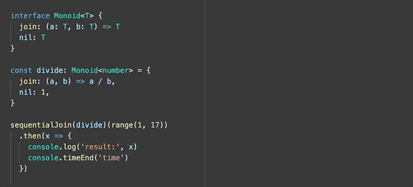

This is the typescript version of what it really means for something to be 
associative.

## TLDR
Associativity allows you to do things like run operations in parallel:


But make sure the operator actually IS associative:



Note the different results. Division is not associative!

## A bit more context 
Associativity is one of the fundamental laws of functional programming concepts
like Monoids and Monads.

Multiplication is associative:
```
3 * 4 * 5 = 60
(3 * 4) * 5 = 60
3 * (4 * 5) = 60
```

Binary logic is NOT:
```
true || true && false = true
(true || true) && false = false
true || (true && false) = true
```

In laymans terms: If you can move the brakets of an expresion around without changing
the result, the expression is associative.

This is an important property for functional programming as it means we can compose
associative things together!

TODO: monad-like example of associativity.


